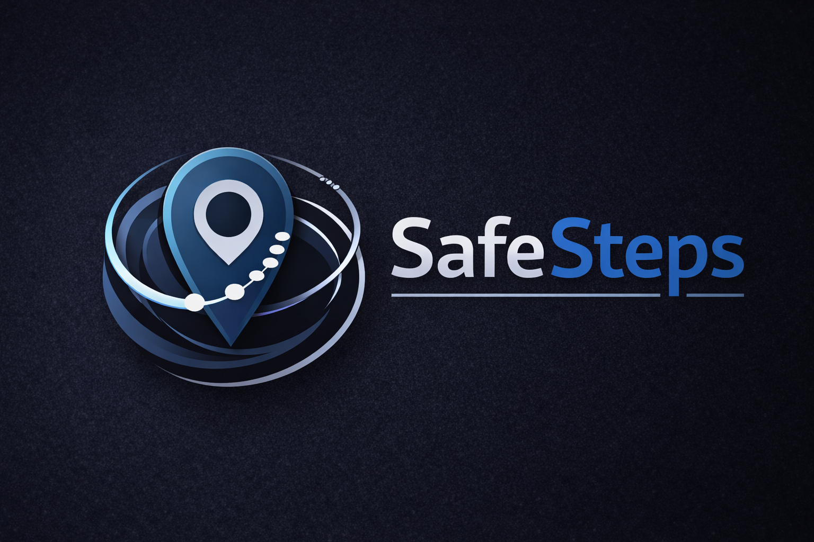

# SafeSteps

<p align="center">
   
</p>

<p align="center">
  <strong>Privacy-first personal safety & location sharing</strong><br />
  Control when your location is shared. No silent tracking. No dark patterns.
</p>

<p align="center">
  
  
  
</p>

---

## Overview

**SafeSteps** is a privacy-first personal safety app designed to help users share their location **only when they choose**.

The app is built around a simple but strict philosophy:

- No silent background tracking  
- No third-party analytics  
- No ad networks  
- No hidden data reuse  
- Clear user-controlled states at all times  

Users can:
- Sign in with an account
- Try the app instantly using **Guest Mode**
- Explicitly enable or disable tracking
- Exit guest mode or log out at any time

SafeSteps prioritizes **clarity, control, and safety over surveillance**.

---

## Project Status

**Pre-v1 — Active Development**

Current state:
- Auth + Guest flow complete
- Deterministic route protection implemented
- Settings + logout behavior stable
- Documentation-first development process in place

In progress:
- Home screen tracking UI
- Location ping storage
- Backend API wiring

This repository is under active development and **not yet released to app stores**.

---

## Core Features (Current)

- Email/password authentication (Supabase)
- Guest Mode (local-only usage)
- Centralized route protection
- Explicit logout / exit guest behavior
- Privacy-focused UI and interaction design
- No background tracking without consent

---

## Tech Stack

**Frontend**
- Expo
- React Native
- Expo Router
- TypeScript

**Backend (in progress)**
- Node.js
- Express
- Supabase (Auth + Postgres + RLS)

**Philosophy**
- Privacy-first by default
- Minimal attack surface
- Deterministic state transitions

---

## Authentication Model

SafeSteps supports two session types:

### Authenticated User
- Backed by Supabase Auth
- Cloud-synced data (future)
- Secure JWT-based API access

### Guest Mode
- Local-only
- No backend writes
- No JWT
- Ideal for “try before signup”

Both are treated as valid sessions for routing purposes.

For full details, see:  
📄 `docs/AUTH_FLOW.md`

---

## Documentation

This project treats documentation as part of the system.

Start here:

- `docs/SAFESTEPS_MASTER_SUMMARY.md` — project brain
- `docs/AUTH_FLOW.md` — auth & guest logic
- `docs/ROADMAP.md` — planned milestones
- `docs/ISSUE_LOG.md` — full debugging history
- `docs/SECURITY_NOTES.md` — security decisions & audits

Docs are kept in sync with code.

---

## Running the App

```bash
npm install
npx expo start
